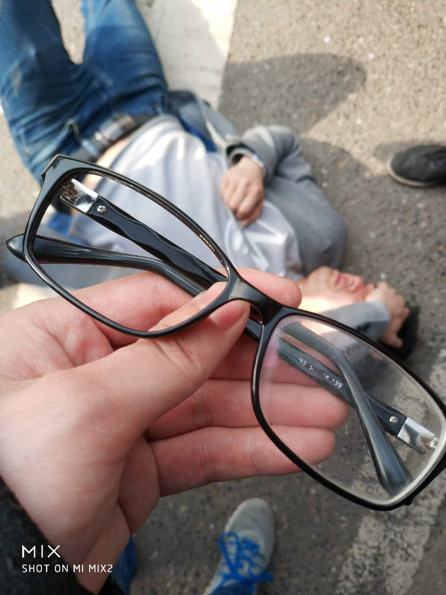
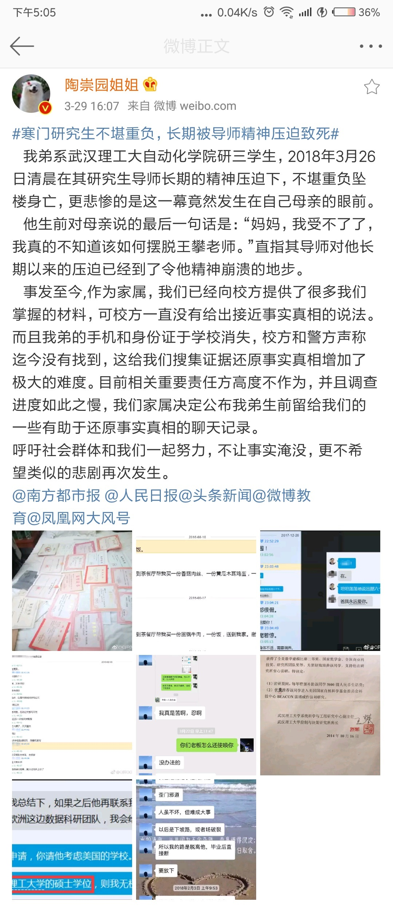
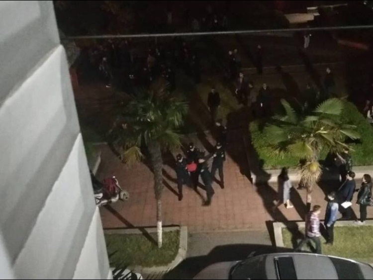
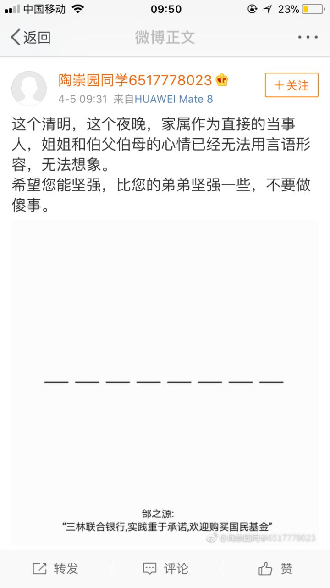

## 悲剧发生
3月26日清晨7点半左右，武汉理工大学研究生陶崇园于马房山校区东院一栋宿舍楼顶纵身跃下，结束了自己年仅26岁的生命。可怜的这一幕竟发生在自己亲生母亲眼前。

## 学校粗暴对待死者家属
3月28日中午，家属与学校沟通要求处置王攀，学校说“目前”认定学校无责，老师无责，但可以出于“人道主义关怀”给予家属5万元抚恤，且以教职工筹款的方式募集。对此，家属与陶的同学们愤慨不已。

3月28日下午4点左右，家属前往学校，于路旁拉起横幅哭诉，横幅刚拉起一半(前半段是“无良导师 压迫我儿”)，立马有保安上来进行粗暴拖拽[视频链接](video/拖拽2.mp4)，还有未穿制服的人员对家属及陶的同学进行殴打[视频链接](video/殴打.mp4)。

陶的同学右眼镜片被打掉，头晕倒地，后被同学送往医院，诊断为轻微脑震荡

本人当时在场，下面还原下学校内部人士的粗暴言语（下面的对话应该有不少在场的人都听到了）

    便衣男士：不许拍照，都给我删掉！
    我：凭什么？
    便衣男士：我让你删就删，你是学校的吗？
    我：不是
    便衣男士：那你来学校干什么？
    我：没什么，你们学校不能进来吗？
    便衣男士：不能！赶紧给我滚！

## 陶崇园姐姐指出与导师有关
3月29日下午4点，陶崇园姐姐在微博上发表话题为“寒门研究生不堪重负，长期被导师精神压迫致死”的微博，曝出数张聊天记录截图，以及陶生前对母亲的最后一句话：“**妈妈，我受不了了，我真的不知道该如何摆脱王攀**”，直指导师对其精神压迫已经达到令他精神崩溃的地步，同时也指出了学校的不作为，甚至试图掩盖事实真相。

[微博链接](https://m.weibo.cn/status/4222940117143306?sourceType=qq&from=1084295010&wm=20005_0002&featurecode=newtitle)

若链接失效可查看下面的微博截图

微博所附图如下：
[微博附图1](img/微博1-1.jpg)
[微博附图2](img/微博1-2.jpg)
[微博附图3](img/微博1-3.jpg)
[微博附图4](img/微博1-4.jpg)
[微博附图5](img/微博1-5.jpg)
[微博附图6](img/微博1-6.jpg)
[微博附图7](img/微博1-7.jpg)
[微博附图8](img/微博1-8.jpg)

## 更详尽的证据
3月30日18:56分，陶崇园姐姐发表微博“怀念挚爱的弟弟：愿天堂没有压迫”。
[微博链接](https://m.weibo.cn/status/4223345052931908?sourceType=qq&from=1084295010&wm=20005_0002&featurecode=newtitle)

由于图片不清晰，陶姐姐于19:09，上传了第二版(只是图片清晰度的差异)。
[微博链接](https://m.weibo.cn/status/4223348210266556?sourceType=qq&from=1084295010&wm=20005_0002&featurecode=newtitle)

其中列举了更加详尽的大量聊天记录和邮件以及短信截图，并且首次提到校方对死者家属的粗暴行径。

其中的证据包括：
1. 全面阻断陶的未来：王攀干扰陶去华科读研，阻断陶去海外读博，甚至在陶选择先参加工作时施以阻挠和处罚（即使参加工作，也要为球队和研究所服务，一旦有读博想法，必须立即联系王攀）。强行且全方位干预陶对未来的选择。
2. 随意使唤奴役：王攀大量占用陶的私人时间。**晚上8、9点要求陶去自己家中**（具体做什么事未知），几乎每天要求陶给自己 **带饭到家**，**洗衣**，甚至作为 **人体闹钟**，还任命陶替其管理球队、研究所以及自己的饭费。（后面有发现更多陶替王攀跑腿转账，就连转给外甥的钱也要经陶之手，微博中未提及）
3. 精神控制：要求陶思想要更接近于自己。
4. 奖学金掌控：每次陶获得的奖学金都要按王攀的意思来分配，更过分的是有一次高达6000的奖学金要求全数捐出，陶分文未取反而还感觉自己欠了人情。
5. 人格践踏：逼迫陶喊其“爸爸”，甚至要求“ **坦坦荡荡**”的说出“ **爸我永远爱你**！”这六个字。

若链接失效可查看下面的微博截图
[微博截图](img/微博2.md)

## 微博热搜一撤再撤，知乎话题数度离奇消失
3月31日-4月2日 微博热搜一撤再撤，知乎话题数度离奇消失，引发网友疑惑和不满。

陶崇园姐姐的微博再也收不到私信，评论数显示于实际相差甚远，网友点赞总是会被离奇撤销，甚至有关注此事的网友发现自己无故“被取关”陶崇园姐姐，妄图掩盖此事的力量如此之强大，连令无数知识分子自豪的社区知乎都已沦陷，再也听不到有关此事的任何声音。头条上全是娱乐八卦，真可谓世间一派和谐！

附上[知乎被删掉的高赞回答](img/知乎38K.md)

## 高中同学被警方带走
4月3日晚，陶崇园高中同学被警方带走。

## 网友自发悼念陶崇园
4月3日-4月5日，临近清明，眼看着追寻事实真相的声音越来越小，微博知乎头条均已沦陷。不少网友深感惋惜，自发送花悼念陶崇园。

4月4日晚，有学生到思源广场送花，被早已等候在此的警务人员押走。(有一篇微博对当晚的事情有所描述，如果有当晚在场人士愿意作证，请联系我。在未确认当晚真实情况前，微博截图我就不发了，放一张现场照片)

## 令人疑惑的道歉声明
4月5日凌晨2点左右，陶崇园姐姐微博突然发出一份声明，令人匪夷所思地向武汉理工大学以及甚至王某做出了道歉（后该微博被删）。
[微博截图](img/陶姐声明.jpg)

4月5日9点，陶崇园同学6517778023发微博安慰家属，并暗示不能说话

间客吧相关暗号截图:[今天我们不能说话](img/不能说话.jpg)

## 尸体火化
4月7日上午，陶崇园火化安葬。

## 迫于压力与学校划清界限
4月7日17:00，陶崇园姐姐发表微博。表示之前申明乃迫于极大压力之下所发（据可靠知情人士透露4月4日当晚陶姐姐被叫到学校，该申明系他人撰写发给陶崇园姐姐，要求其发出，并且一个字都不许改。），非其本意，已安葬弟弟，并会起诉王攀，希望避免类似悲剧重演。

[微博链接](https://m.weibo.cn/status/4226214980236417?sourceType=qq&from=1084295010&wm=20005_0002&featurecode=newtitle)

[若链接失效，点击此处查看截图](img/微博4-7.jpg)

## 武汉理工大学情况通报
4月8日12:29，武汉理工大学发表微博“情况通报”。表示排除他杀，深感痛惜。高度重视，已协助家属善后，经 **深入调查** 发现：王攀于学生存在 **认“义父子”** 行为，以及指导学生升学就业方式 **欠妥**，其他情况（家属所说的阻挠去他校读研海外读博、侵占学生经济利益（分配奖学金）、让学生到家洗衣送饭捏脚捶背下跪等）一概未知。

[微博链接](https://m.weibo.cn/status/4226509110027138?sourceType=qq&from=1084295010&wm=20005_0002&featurecode=newtitle)

[若该微博被删，请点击此处查看截图](img/武理情况通报.md)

目前该微博已禁止转发，禁止评论。该通报上没有通报日期，撰写人，是否具有效应尚未可知。

## 王攀拒绝与家属见面
直至4月16日，我们一直尝试以各种方式联系王攀，试图了解更多事实真相以及王攀本人的想法和态度。使用各种邮箱、手机、座机、短信、QQ、媒体、也请过学校出面协调。

4月15日，学校转述王攀以担心人身安全为由拒绝与家属见面，再次请求，仍遭拒绝。

## 行政处罚申请书
4月8日，陶崇园姐姐向教育部递交对王攀的行政处罚申请书。
4月16日，陶崇园姐姐发表微博，该微博显示教育部已签收该申请书。

[微博链接](https://m.weibo.cn/status/4229484297577660?sourceType=qq&from=1084295010&wm=20005_0002&featurecode=newtitle)

[若微博被删，请点击此处查看截图](img/微博4-16.jpg)

[申请书截图](img/对王攀行政处罚申请书.md)

## 敦促学校实施处罚
4月17日，微博名为“周Wayne”网友发微博指出，截止4月17日(距离武理微博通告9天)，在校方微博通告停止王攀招生后，仍然在博士拟录取名单中发现有学生录取王攀的博士，周Wayne请校方澄清。陶崇园姐姐转发改微博，并评论“请学校言而有信”。武汉理工大学对此事至今仍无任何回应。

[周Wayne原微博](https://m.weibo.cn/status/4229888686757849?sourceType=qq&from=1084295010&wm=20005_0002&featurecode=newtitle) 现该微博账户已不幸被封。

[陶崇园姐姐转发](https://m.weibo.cn/status/4229896316034287?sourceType=qq&from=1084295010&wm=20005_0002&featurecode=newtitle)

[若微博被删，请点击查看截图](img/微博4-17.jpg)

## 法院立案
4月19日，陶崇园姐姐转发金宏伟律师的微博。透露出家属已上交诉讼费，意味着法院已立案。

[微博链接](https://m.weibo.cn/status/4230135429732775?sourceType=qq&from=1084295010&wm=20005_0002&featurecode=newtitle)

[若微博被删，请点击此处查看截图](img/微博4-19.md)

当日律师金宏伟于微信上就立案的事情发表说明
[点此查看律师金宏伟说明](img/律师金宏伟说明.md)

## 4月19日校方内部情况录音通报
4月20日00:49，被封的周蔚使用小号ZhouWayne发布了一条微博，透露有可靠信源提供了一份学校内部情况通报录音。周表示，录音中，校方谎话连篇、颠倒黑白、污蔑死者家属。

[点此查看录音整理](img/4月19日校方内部通报录音整理.md)
