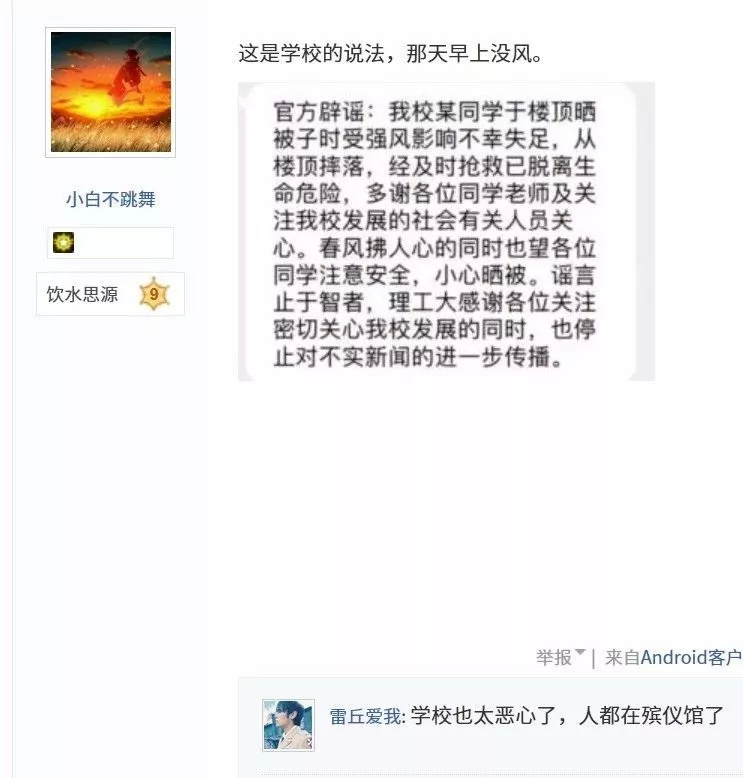
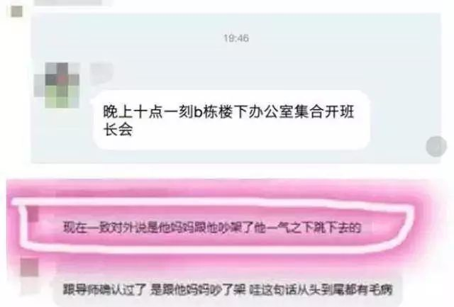
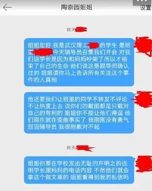
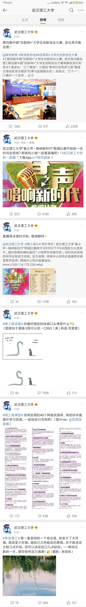
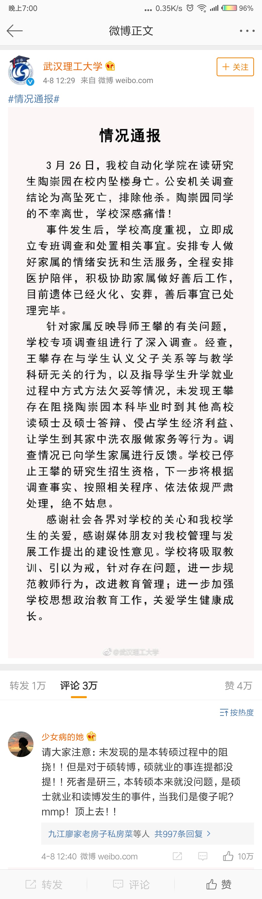
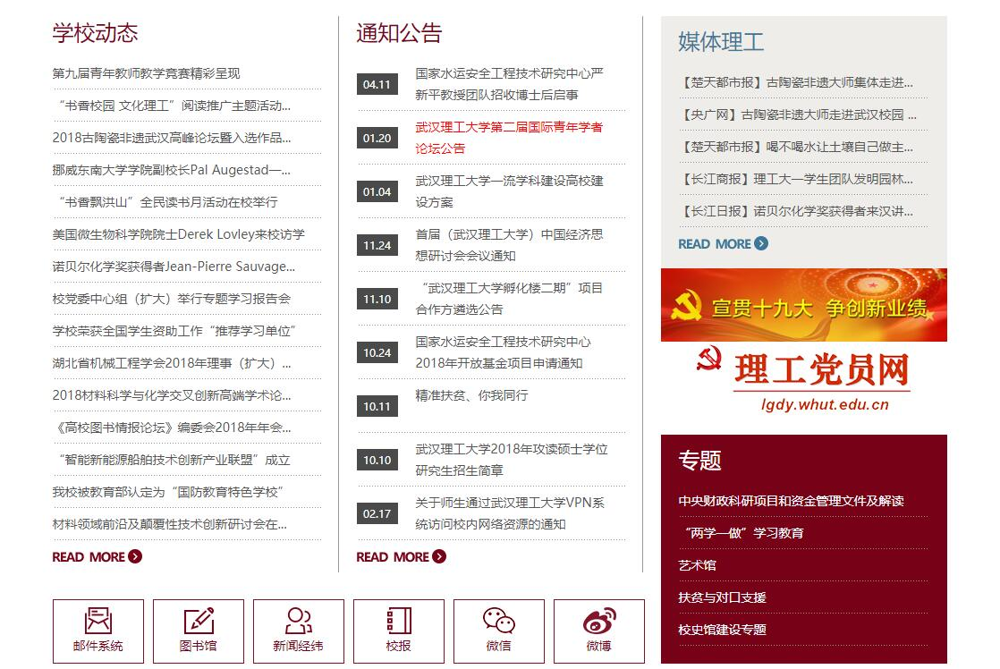
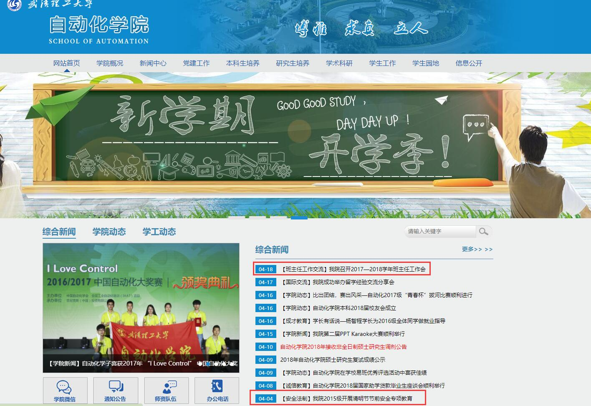

# 学校反应

## 学校无责，正在调查
事发之后，在事情还没调查清楚的情况下，学校发出第一份公告:陶同学的坠楼是因为收被子，风太大，被刮下去的。
接着，那个曾经“培养”过陶同学的王攀先是说：研究所新招成员，无论是教师还是学生，必须通过心理测验。把大众的注意力都转移到精神疾病上。接着又说： 喊爸爸，安排他做家务都是经过双方一致协商之后形成的语言系统，还顺道展现自己作为导师关怀学生的风尚。王攀发声之后，风太大的说辞站不住脚了。

3月26日-3月29日陶姐发微博，王攀仍然在继续上课，事发后的数次沟通中，学校称已成立专项调查组，正在调查。之后学校出了第二版公告，
就目前掌握的信息（具体调查了什么，掌握了什么没有向家属透露，只讲过手机的调查）来看校方无责，导师无责，学校愿意出于人道主义帮扶，给予家属5万元抚恤，且以教职工捐款形式募集。

这份声明没有确凿事实作为依据。学校组织跟这件事相关的人员开会，定下了一个官方回复：陶同学之所以会跳楼，是因为和他母亲吵架了，一时想不开才会轻生。

陶的手机问题，学校称无法找到，曾定位该手机于7点50左右在东院附近关机，范围太大无法精确定位。

## 学校粗暴对待死者家属
3月28日中午，家属与学校沟通要求处置王攀，学校说“目前”认定学校无责，老师无责，但可以出于“人道主义关怀”给予家属5万元抚恤，且以教职工筹款的方式募集。对此，家属与陶的同学们愤慨不已。

3月28日下午4点左右，家属前往学校，于路旁拉起横幅哭诉，横幅刚拉起一半(前半段是“无良导师 压迫我儿”)，立马有保安上来进行粗暴拖拽[视频链接](video/拖拽2.mp4)，还有未穿制服的人员对家属及陶的同学进行殴打[视频链接](video/殴打.mp4)。

陶的同学右眼镜片被打掉，头晕倒地，后被同学送往医院，诊断为轻微脑震荡

本人当时在场，下面还原下学校内部人士的粗暴言语（下面的对话应该有不少在场的人都听到了）

    便衣男士：不许拍照，都给我删掉！
    我：凭什么？
    便衣男士：我让你删就删，你是学校的吗？
    我：不是
    便衣男士：那你来学校干什么？
    我：没什么，你们学校不能进来吗？
    便衣男士：不能！赶紧给我滚！

## 3月29日微博
3月29日，与陶姐发博同一天，武汉理工大学官方微博发布了6条微博。

## 4月4日 封锁思源广场
4月3日-4月5日，悼念陶崇园的花没能进到思源广场便被没收，有的甚至没能进校门。

4月4日晚，有学生到思源广场送花，被早已等候在此的警务人员押走。(有一篇微博对当晚的事情有所描述，如果有当晚在场人士愿意作证，请联系我。在未确认当晚真实情况前，微博截图我就不发了，放一张现场照片)

## 4月8日情况通报
4月8日中午，武汉理工大学官方微博发表情况通报。该通报目前已经禁止评论转发，没有任何落款，是否具有效应尚未可知。

## 4月12日爱国卫生活动
4月12日，武汉理工大学官方微博举办“爱国卫生活动”，有兴趣的同学可以前往查看，这里我就不浪费篇幅贴图了

## 截至4月24日，再无任何消息
截至4月24日，除了4月8日的那篇情况通报，武汉理工大学官方微博再无任何相关信息。

武理官网，无任何相关信息：

武理自动化学院官网，无任何相关信息：

