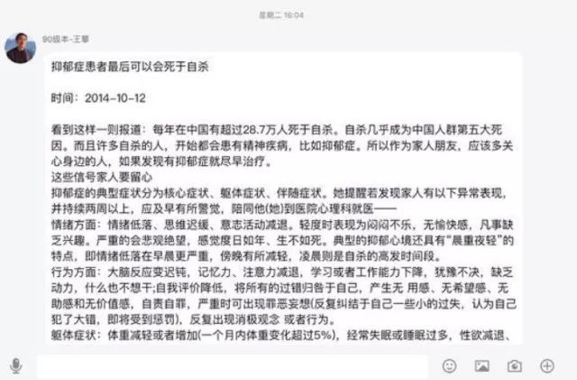
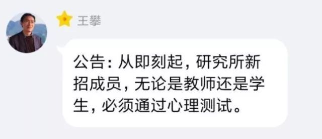
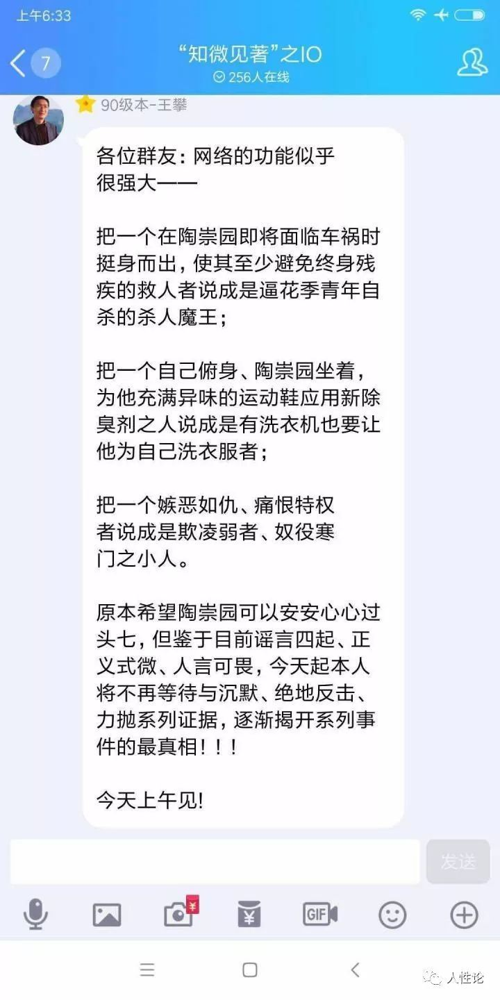
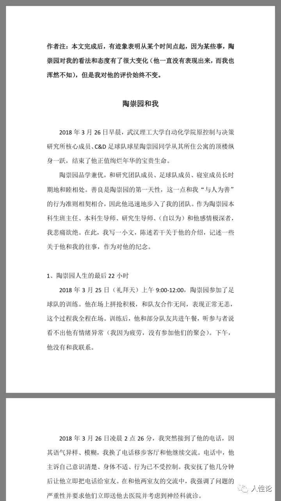
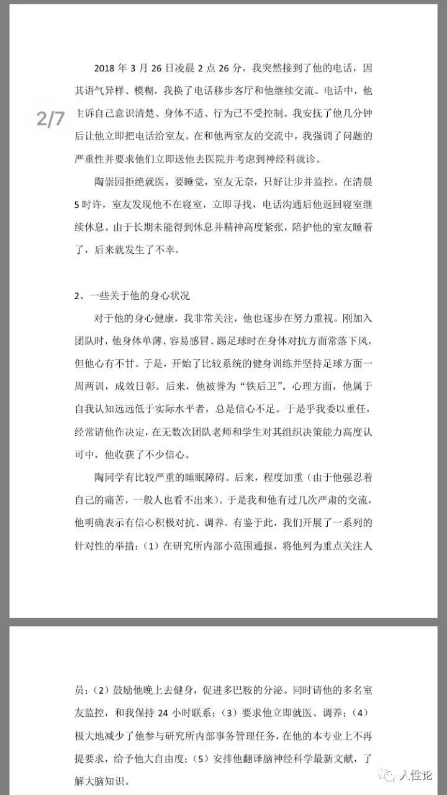
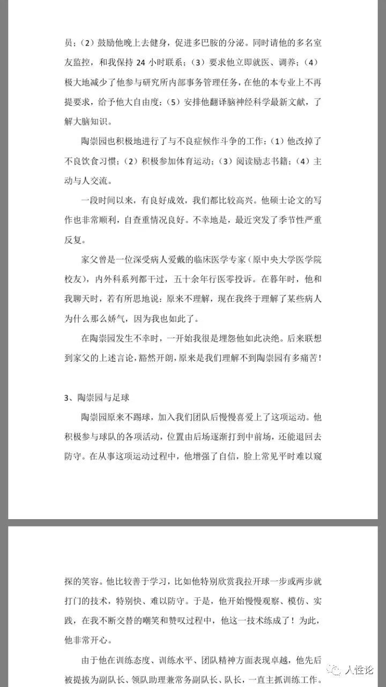
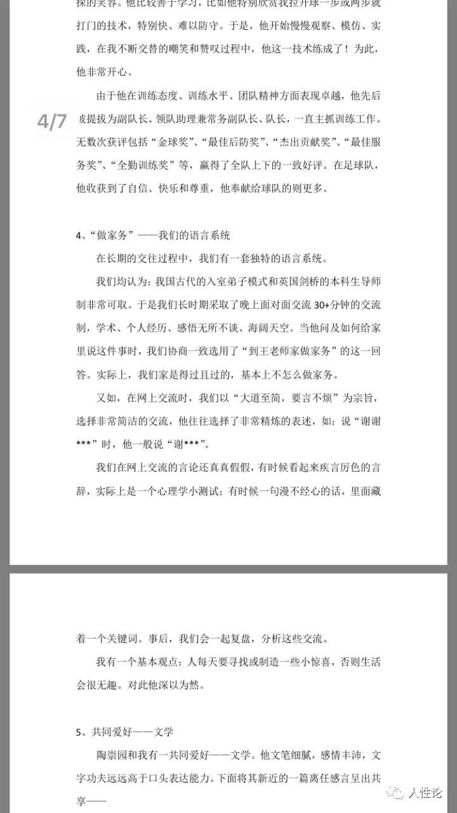
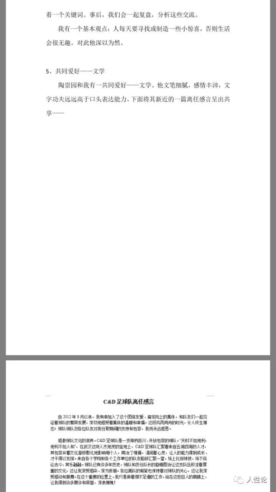
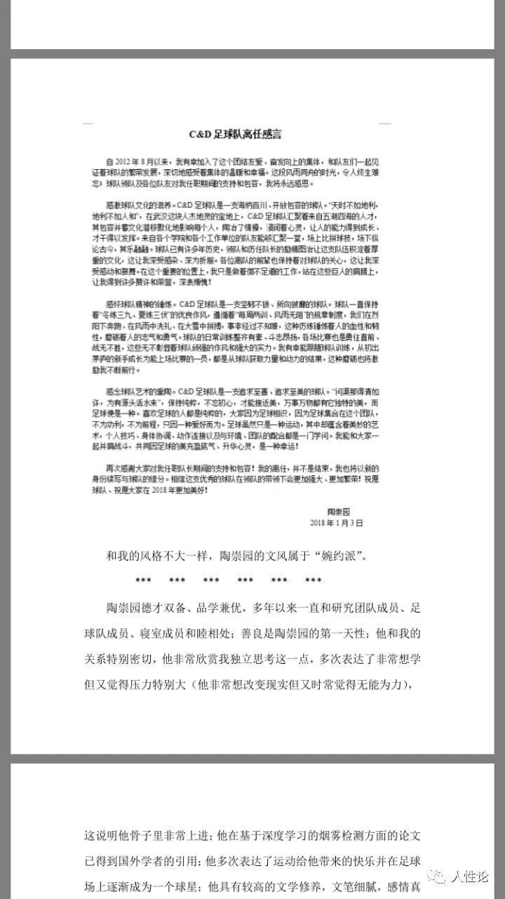
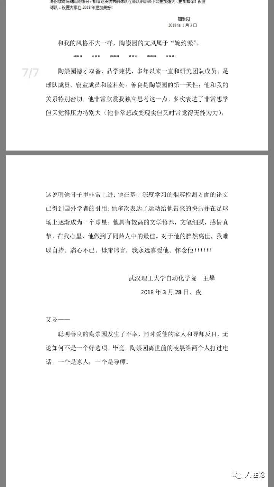

## 事后回应
王攀时候在qq群中，发表抑郁症患者会死于自杀的报道，并公告研究所新招成员必须通过心理测试，还称自己将绝地反击。

## “绝地反击”
网上流出一篇落款为王攀，标题为“陶崇园和我”的文章，至今王攀未对此文做任何回应。

以下是该文截图（没找到原出处，不是很清晰，请见谅）

## 拒绝与家属见面
直至4月16日，我们一直尝试以各种方式联系王攀，试图了解更多事实真相以及王攀本人的想法和态度。使用各种邮箱、手机、座机、短信、QQ、媒体、也请过学校出面协调。

4月15日，学校转述王攀以担心人身安全为由拒绝与家属见面，再次请求，仍遭拒绝。

