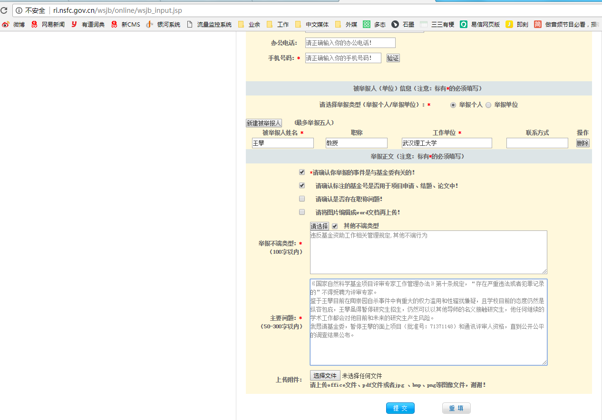
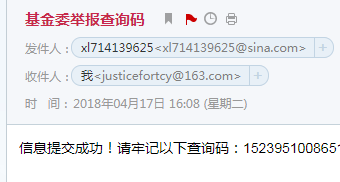
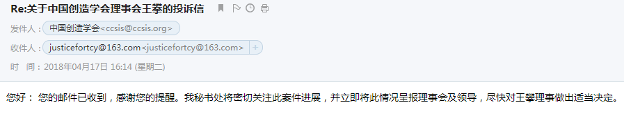
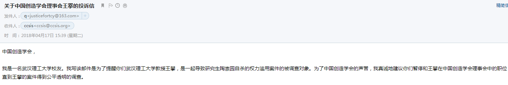

## 4月4日 校友公开信第一版
4月4日晚，周蔚发布了《480位武汉理工大学校友关于陶崇园事件的公开信》第一版

[校友公开信](img/ZhouWayne1.md)

## 4月7日
4月7日中午 周蔚给武汉理工大学宣传部负责人阎高程发送了一份个人声明

[个人声明](img/ZhouWayne2.md)

## 4月8日  
4月8日中午 周蔚发布一份对武汉理工大学陶崇园事件情况通报的个人声明

[个人声明](img/ZhouWayne3.md)

## 4月12日 校友留言 
4月12日整理的部分联署校友留言截图

[部分校友留言](img/ZhouWayne4.md)

## 4月15日 校友公开信终版
4月15日 480名校友关于武汉理工大学陶崇园事件的公开信（终版）

[校友公开信](img/ZhouWayne6.md)

## 4月17日 校友至有关部门公开信
4月17日 256名武汉理工大学老师校友致教育部和国家监察委的公开信

[校友公开信](img/ZhouWayne7.md)

4月17日 周蔚向国家自然科学基金基金委和创造学会举报王攀

